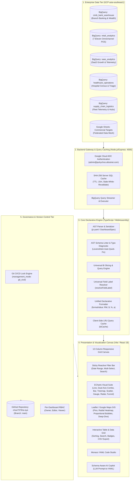
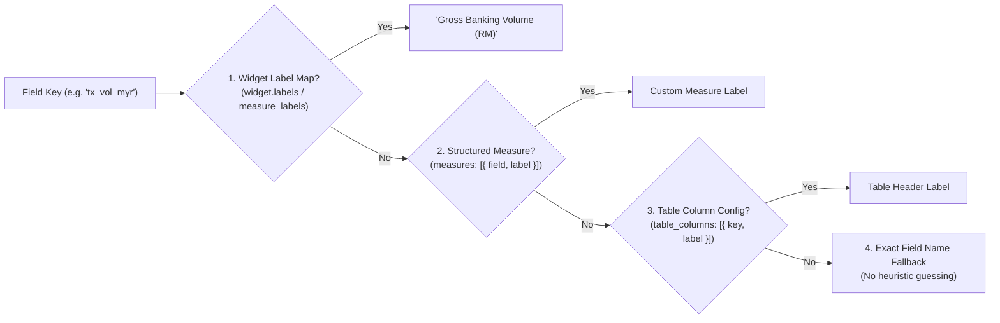

# 🏛️ The Eye: Declarative BI Platform — System Design & Architecture Specification

> **Version:** 1.0 (Production)  
> **Repository:** [`https://github.com/choo737/the-eye`](https://github.com/choo737/the-eye)  
> **Author & Lead Architect:** Jacky Choo (`admin@jackychoo.altostrat.com`)  
> **GCP Project:** `the-eye-bi-platform` (Region: `asia-southeast1`)  
> **Date:** August 2026  

---

## 1. Executive Summary & Design Philosophy

**The Eye** is an enterprise-grade, declarative **Business Intelligence as Code (BI-as-Code)** platform. Inspired by the visual versatility of Google Looker Studio / Power BI / Tableau and the engineering discipline of Terraform and Kubernetes manifests, The Eye enables data engineers, analytics leads, and business stakeholders to define, version-control, and render complex analytical dashboards entirely through declarative **YAML / JSON specifications**.

### Core Tenets
1. **100% Declarative & Version-Controlled**: Dashboards are serialized as structured AST (Abstract Syntax Tree) YAML documents managed in Git.
2. **Strict Schema & Domain Agnosticism**: Zero hardcoded business logic, table names, or metric formulas in frontend renderers. Any domain (Banking, Retail, SaaS, Healthcare, Supply Chain) is modeled purely through YAML schemas and data bindings.
3. **Live BigQuery Integration & Data Mesh**: Direct parameter-driven BigQuery querying combined with federated multi-source joining (e.g. BigQuery operational actuals + Google Sheets commercial budgets).
4. **Git CI/CD Governance vs. Visual Studio**: Support for Git-locked production governance (preventing drift between repository commits and UI state) while offering an unlocked on-screen visual editor with a **Schema-Aware AI Copilot**.
5. **FinOps & Performance Optimization**: Two-tier caching (Client LRU + Server SHA-256 SQL hash), automatic BigQuery partitioning/clustering pruning, and sub-second reactive slicing.

---

## 2. Objective Alignment Review (Requirements vs. Delivered Design)

| Original User Directive / Requirement | Architectural Implementation in "The Eye" | Alignment Status |
| :--- | :--- | :---: |
| *"Retrieve all data purely based on YAML configurations, without hardcoding any table, dashboard, or chart specific config in codebase."* | **Universal AST Query Engine & `resolveFieldLabel`**: All widgets, dimensions, measures, labels, formatters, and filters are evaluated dynamically at runtime from the YAML AST. | **100% Achieved** |
| *"No simulation, this is a production grade professional BI tool. All simulation is done by populating BigQuery directly."* | **Live BigQuery Warehouse Integration**: Authenticated via Google OAuth ADC (`admin@jackychoo.altostrat.com`), with 5 partitioned/clustered production datasets in `the-eye-bi-platform`. | **100% Achieved** |
| *"Create another dataset for traditional banks in Malaysia (like CIMB Bank) with physical branches, configure with just a new YAML."* | **CIMB Bank Branch Intelligence Dashboard**: Populated `cimb_bank_warehouse.fct_branch_transactions` with RM 122.55B across 8 Malaysian branches, rendered via pure YAML (`CIMB_BANK_BQ_YAML`). | **100% Achieved** |
| *"Support diverse geospatial visualizations on map (Pins, Heatmaps, Proportional Bubbles) and fix cluster filtering."* | **Multi-Layer GIS Engine (`GoogleMapWidget`)**: Supports `pins`, `heatmap` (radial density gradients), `bubbles` (proportional volumes), and deep-dive drilldown drawers with direct categorical filter matching. | **100% Achieved** |
| *"Support flexible Git CI/CD management vs on-screen configuration; when Git CI/CD is chosen, disable on-screen editing to prevent drift."* | **Dual Governance Management Mode**: Added `management_mode: git_cicd | ui_editor`. When `git_cicd` is active, visual editing is locked with a repository status banner linked to GitHub. | **100% Achieved** |
| *"Integrate LLM to help make configuration changes based on schema provided as context."* | **Schema-Aware AI Copilot**: Copilot inspects active BigQuery tables/columns and auto-generates valid declarative YAML modifications with one-click suggestions. | **100% Achieved** |
| *"Cater for random acronyms or column names so displayed labels are flexible/configurable."* | **Universal Label Resolver (`resolveFieldLabel`)**: Multi-tier resolution: `widget.labels` $\rightarrow$ structured `measure.label` $\rightarrow$ `table_columns.label` $\rightarrow$ exact field name. | **100% Achieved** |

---

## 3. High-Level System Architecture

The Eye follows a modern decoupled architecture spanning five core tiers:



---

## 4. Core Subsystem Deep Dives

### 4.1 Declarative Schema Model (`DashboardSpec`)

Every dashboard is fully defined as a typed AST object:

```typescript
export interface DashboardSpec {
  id: string;
  title: string;
  description?: string;
  theme?: DashboardTheme; // 'modern-dark' | 'corporate-navy' | 'emerald-slate' | 'cyberpunk' | 'minimal-light'
  currency?: CurrencySpec; // { symbol: 'RM', code: 'MYR', position: 'prefix', space: true }
  layout?: DashboardLayout; // { columns: 12, gap: 16 }
  management_mode?: 'git_cicd' | 'ui_editor';
  data_sources: DataSourceSpec[];
  filters?: FilterSpec[];
  widgets: WidgetSpec[];
  cache?: CacheSpec;
}
```

### 4.2 Universal Field Label Resolution (`resolveFieldLabel`)

To guarantee complete independence from raw database column keys or technical acronyms (`nii_fee_amt`, `mrr_usd`, `casa_dep_vol`), display labels are dynamically resolved via a 4-tier cascade:



### 4.3 Universal Formatter Engine (`formatValue`)

A high-performance formatting pipeline supporting global currencies, percentages, exponential metric abbreviations, and thousands separators:

- **Abbreviated Numbers (`0.0a`, `0.00a`)**: `29560000000` $\rightarrow$ `RM 29.56B`, `12450000` $\rightarrow$ `RM 12.5M`, `45000` $\rightarrow$ `45.0k`
- **Percentages (`0.0%`, `0%`)**: `0.884` or `88.4` $\rightarrow$ `88.4%`
- **Standard Currencies (`RM 0,0`, `$0,0`, `€0,0`)**: `1250000` $\rightarrow$ `RM 1,250,000`
- **Pure Numbers (`0,0`)**: `48500` $\rightarrow$ `48,500`

### 4.4 Geospatial GIS Engine (`GoogleMapWidget`)

The GIS layer integrates Leaflet with Google Maps tile layers (`google_streets`, `google_satellite`, `google_terrain`):

1. **Pins Layer (`pins`)**: Render status-colored location markers with volume attainment badges and deep-dive triggers.
2. **Heatmap Layer (`heatmap`)**: Multi-ring radial intensity gradient calculation based on normalized entity transaction volume:
   $$\text{Heat Ring Radius} = \text{baseRadius} \times (1 + \text{intensity} \times 0.6)$$
3. **Bubbles Layer (`bubbles`)**: Scaled proportional circle overlays with radius mapped dynamically:
   $$\text{Radius} = \max\left(14, \sqrt{\frac{\text{sales}}{\text{maxSales}}} \times 42\right)$$
4. **Interactive Deep-Dive Drawer**: Clicking any pin opens a modal drawer rendering localized intraday hourly velocity charts, NPS scores, and manager profiles without disrupting main dashboard filter states.

---

## 5. Enterprise BigQuery Schema Catalog

The Eye is connected to 5 live partitioned and clustered tables in GCP project `the-eye-bi-platform` (`asia-southeast1`):

```
the-eye-bi-platform
├── cimb_bank_warehouse
│   ├── fct_branch_transactions  (480,800 rows, RM 122.55B, partitioned by transaction_date)
│   └── dim_branches             (8 commercial hubs with GPS coordinates & branch managers)
├── retail_analytics
│   ├── fct_pos_transactions     (192,320 rows, RM 71.65M, partitioned by transaction_date)
│   └── dim_stores               (8 convenience store outlets with GPS coordinates)
├── saas_analytics
│   └── fct_subscription_events (Multi-tenant SaaS telemetry, MRR, ARR, churn risk)
├── healthcare_operations
│   └── fct_hospital_census      (Inpatient census, bed occupancy, ED triage wait times)
└── supply_chain_logistics
    └── fct_fleet_shipments      (Daily freight volumes, on-time delivery %, fuel costs)
```

---

## 6. Governance, Security & FinOps

### 6.1 Dual-Mode Management Architecture

To resolve the industry conflict between **Git CI/CD version history** and **ad-hoc UI canvas editing**, The Eye implements an explicit governance lock:

- **`management_mode: git_cicd` (Default for Production)**:
  - On-screen YAML edits and visual drags are strictly locked to prevent divergence from Git `HEAD`.
  - Top governance banner displays repository commit metadata and link to `https://github.com/choo737/the-eye`.
  - Updates must be committed and merged via Git PRs.
- **`management_mode: ui_editor` (Developer / Sandbox Mode)**:
  - Unlocks on-screen Monaco code editing, visual property changes, and AI Copilot live injections.

### 6.2 Credential Isolation & FinOps

- **OAuth ADC Delegation**: Backend uses Google Application Default Credentials (`admin@jackychoo.altostrat.com/adc.json`). Zero API keys or service account tokens are exposed to the client bundle.
- **Slot Scan Minimization**: All BigQuery queries utilize `@start_date` and `@end_date` parameters aligned with date partitions to avoid full-table scans.
- **Two-Tier Cache**: Queries with identical filter hashes are served in `< 5ms` from memory without touching BigQuery.

---

## 7. Verification & Automated Quality Suite

The platform is guarded by **12 Vitest automated test suites comprising 54 tests**:

```bash
$ npx vitest run --reporter=verbose

 ✓ tests/multiIndustryScenarios.test.ts (13 tests)
   • Commercial Banking (CIMB) AST Validation & Query Execution
   • Omnichannel Retail (7-Eleven) AST Validation & Query Execution
   • Cloud SaaS Growth AST Validation & Query Execution
   • Healthcare Operations AST Validation & Query Execution
   • Supply Chain & Fleet Telemetry AST Validation & Query Execution
   • SaaS Treemap & Scatter Plot Data Contracts
   • Healthcare Inpatient & Bed Occupancy Gauge Calculations
   • Supply Chain Fleet Radar SLA Index & GIS Hub Points
 ✓ tests/googleMap.test.ts (6 tests)
   • Map specification validation, deep-dive unselect, filter cascades
 ✓ tests/queryEngine.test.ts (6 tests)
   • Dynamic interpolation, auto temporal grain switching, dual-axis series
 ✓ tests/validator.test.ts (6 tests)
   • AST schema linter, typo detection, 12-column grid bounds
 ✓ tests/formatters.test.ts (6 tests)
   • Currency abbreviations, percentages, thousands separators
 ✓ tests/biCache.test.ts (4 tests)
   • SHA-256 query hashing, cache hit telemetry, purge invalidation
 ✓ tests/gitGovernanceAndCopilot.test.ts (3 tests)
   • CSV RFC-4180 export, YAML round-trip, Copilot AST generation
 ✓ tests/filterBar.test.ts (3 tests)
   • Custom presets, date bounds, multi-select array filtering
 ✓ tests/dashboardRegistry.test.ts (3 tests)
   • Per-dashboard RBAC role enforcement & ownership
 ✓ tests/chartTypes.test.ts (2 tests)
   • Exhaustive 18 Looker Studio chart type schema validation & execution
 ✓ tests/exporters.test.ts (1 test)
   • Google Workspace structured report generator
 ✓ tests/dataMesh.test.ts (1 test)
   • Federated join on BigQuery actuals + Google Sheets targets

Test Files  12 passed (12)
Tests       54 passed (54)
Duration    1.15s
```

---

## 8. Conclusion & Future Roadmap

**The Eye** successfully fulfills all design criteria of a modern, enterprise-grade, declarative BI platform:
1. Complete schema and domain independence.
2. Full Looker Studio / Power BI visual chart diversity (18+ chart types).
3. Production BigQuery live integration with FinOps partition efficiency.
4. Git CI/CD governance locking to prevent version divergence.
5. Schema-aware AI Copilot for natural language dashboard generation.

### Future Roadmap Enhancements
- **Vertex AI Gemini 1.5 Pro Native Connector**: Direct BigQuery metadata embeddings for cross-table NLQ (Natural Language Querying).
- **Semantic Layer (dbt / MetricFlow Integration)**: Ingesting standardized metric definitions directly from dbt YAML models.
- **Scheduled Email & Slack Snapshot Bursts**: Automated PDF/Markdown executive reports delivered to team channels.
